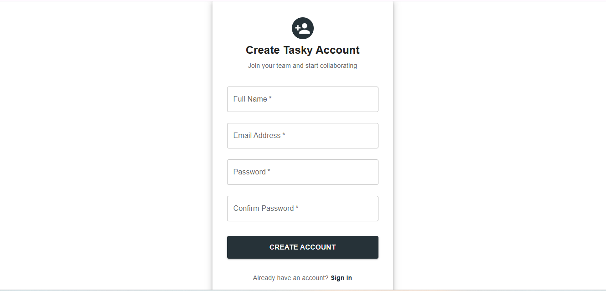
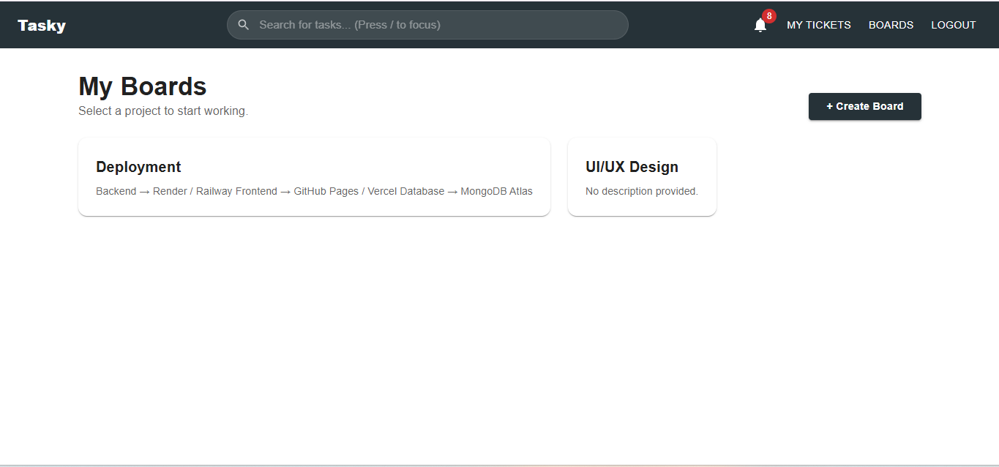
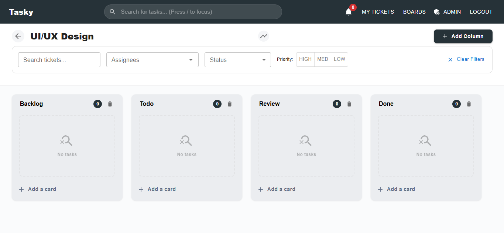

# Task Management Web App

A full-stack Task Management application built with MongoDB, Express.js, React, and Node.js. Features user authentication, task creation, management, and organization.

---

## 📋 Table of Contents
- [Live Demo](#-live-demo)
- [Features](#-features)
- [Tech Stack](#-tech-stack)
- [Screenshots](#-screenshots)
- [Quick Start](#-quick-start)
- [Project Structure](#-project-structure)
- [Environment Variables](#-environment-variables)
- [Deployment](#-deployment)
- [Contact](#-contact)

---

## 🌐 Live Demo

| Component | URL | Status |
|-----------|-----|--------|
| **Frontend** | [https://task-management-web-app-puce.vercel.app](https://task-management-web-app-puce.vercel.app) | 🟢 Live |
| **Backend API** | [https://task-management-backend-q4y1.onrender.com](https://task-management-backend-q4y1.onrender.com) | 🟢 Live |
| **GitHub Repo** | [https://github.com/Sandeep-gangwar/Task-Management-Web-App](https://github.com/Sandeep-gangwar/Task-Management-Web-App) | 📦 Code |

---

## ✨ Features

| Category | Features |
|----------|----------|
| **Authentication** | User Registration, Login, JWT Authentication |
| **Tasks** | Create, Read, Update, Delete tasks |
| **Task Management** | Mark tasks as complete/incomplete, Filter tasks |
| **User Interface** | Responsive Design, Modern UI, Toast Notifications |
| **Security** | JWT Tokens, Password Hashing, Rate Limiting, Helmet.js |

---

## 🛠️ Tech Stack

| Layer | Technologies |
|-------|-------------|
| **Frontend** | React.js, Vite, React Router, Axios, CSS Modules |
| **Backend** | Node.js, Express.js, JWT, bcrypt, Nodemon |
| **Database** | MongoDB Atlas, Mongoose ODM |
| **Deployment** | Vercel (Frontend), Render (Backend), GitHub |

---

## 📸 Screenshots

| Signup Page |
|------------|
|  |

| Login Page |
|----------------|
|  |

| Dashboard |
|------------|
|  |

| Create Task |
|-------------|
|  |

## 🚀 Quick Start

### Option 1: Use Live App
Simply visit: **https://task-management-web-app-puce.vercel.app**

### Option 2: Run Locally

# 1. Clone the repository
git clone https://github.com/Sandeep-gangwar/Task-Management-Web-App.git
cd Task-Management-Web-App

# 2. Setup Backend
cd backend
npm install

# 3. Create .env file in backend folder
Add these variables (see Environment Variables section below)

# 4. Start Backend Server
npm run dev

# 5. Setup Frontend (Open a new terminal)
cd frontend
npm install

# 6. Create .env file in frontend folder
Add this variable: VITE_API_URL=http://localhost:5000/api

# 7. Start Frontend Server
npm run dev

# 8. Access your local app:

Frontend: http://localhost:5173
Backend: http://localhost:5000

## 🚢 Deployment

Backend (Render)
Push code to GitHub
Connect repository to Render
Set root directory: backend
Add environment variables
Deploy

Frontend (Vercel)
Connect GitHub repository to Vercel
Set root directory: frontend
Add environment variable: VITE_API_URL
Deploy

## 📞 Contact
Sandeep Gangwar

GitHub: @Sandeep-gangwar

Project Link: https://github.com/Sandeep-gangwar/Task-Management-Web-App

⭐ Support
If you found this project helpful, please give it a star on GitHub!

   

 Made with ❤️ by Sandeep Gangwar   Copyright © 2026 
 